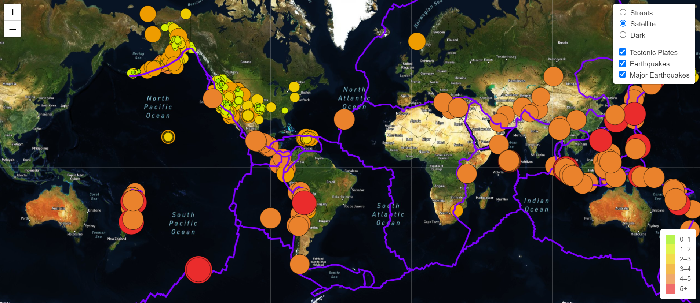

# Mapping Earthquakes

## Overview
Clients Basil and Sadhana had asked for our assistance in creating an interactive earthquake map that allows users to sift through multiple map views to view the intensity and areas of where they have appeared within the last seven days. Geographical features have been included to reflect the multiple points of earthquake activity globally as well as the creation of pop up markers to provide us information such as earthquake magnitude and location as we hover through all of the activity. Not only has this developed to be an informative site, but eye-catching for new users to navigate and explore the most recent earthquakes the past recent week.

## Tech Used:
- Mapbox API
- JavaScript
- Leaflet.js
- D3.js
- GeoJSON Data
- HTML
- CSS

## Dataset: 
- U.S. Geological Survey: GeoJSON Feed of All Earthquakes Past 7 Days

## Objectives:
- Merge a branch with the main branch on GitHub.
- Retrieve data from a GeoJSON file.
- Make API requests to a server to host geographical maps.
- Populate geographical maps with GeoJSON data using JavaScript and the Data-Driven Documents (D3) library.
- Add multiple map layers to geographical maps using Leaflet control plugins to add user interface controls.
- Use JavaScript ES6 functions to add GeoJSON data, features, and interactivity to maps.
- Render maps on a local server.

## Results
Additional features were recommended to be added to provide further visual information of our earthquake data. The new visuals consist of the following:
-	comparing earthquake intensity in relation to the tectonic plates’ location on earth; 
-	viewing all earthquakes with a magnitude of 4.5 or greater on the map
-	view the data on a third map view

Ultimately, the new site clearly delineates where the tectonic plates are located in comparison with the occurrences of the earthquakes as well as visually distinguish the major earthquakes with a magnitude of 4.5. Likewise, we established a new map view in dark that can be used just as the other two initially provided to toggle through the data. 

## Summary 
This project allowed for a more interactive experience and connectivity with data in relation to using maps to tell a story. The results assisted in demonstrated several key skills needed and tying coding from JavaScript to more visual run programs. We were able to construct overlays and controls that will allow the user to choose how they want to view the data and what data they would like to see. The optionality and customization makes this map all the more dynamic. Creating a key that will allow site users to understand the association of each color of earthquake with the magnitude level of the event. Lastly, the creation of an additional map layer that provide the customization to its users. 
